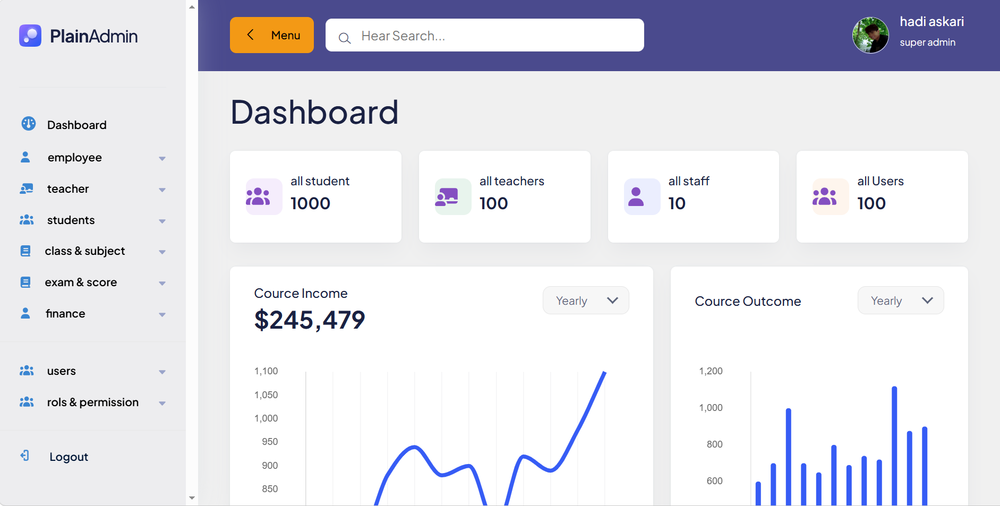
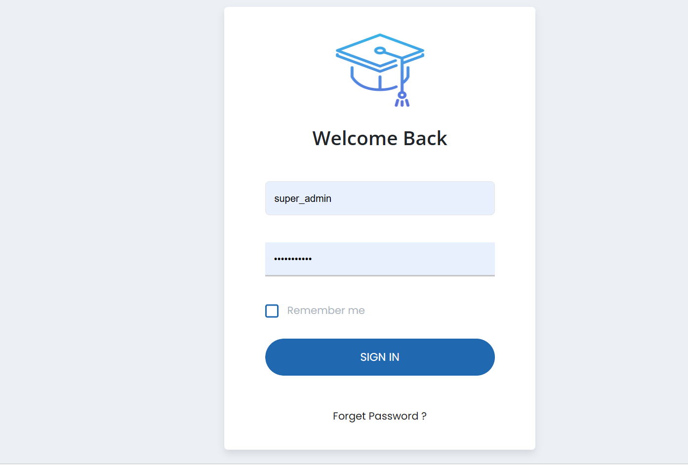

# Course Management System

## Dashboard

## login

## 🚀 About Project
This is a Laravel-based Course Management System for managing students, teachers, classes, and schedules.

## ⚙️ Features
- User authentication (Admin / Teacher)
- Course management
- Student enrollment
- Role & permission system
- Attendance system

## 🛠 Tech Stack
- Laravel
- MySQL
- Bootstrap
- Spatie Permission

## 📦 Installation
composer install  
cp .env.example .env  
php artisan key:generate  
php artisan migrate --seed  
php artisan serve  

## 👨‍💻 Author
Hadi Askari
askari.ian.01@gmail.com
